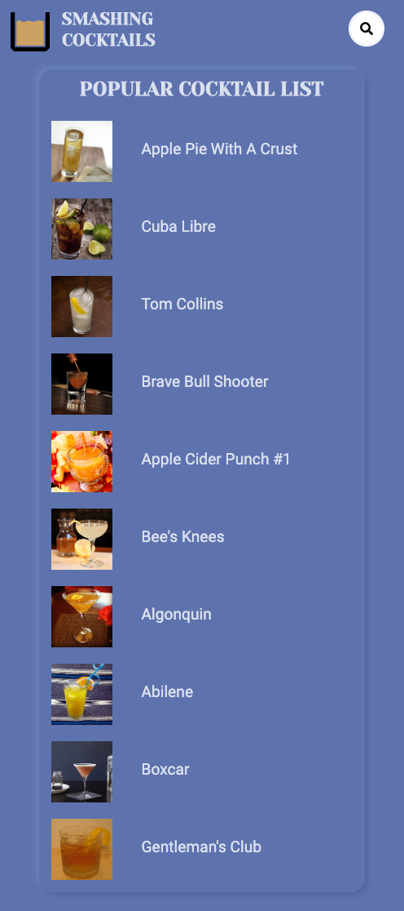

# Smashing-Cocktails

https://jurkel.github.io/Smashing-Cocktails/

Uses four different API calls to retrieve a popular list of ten cocktails, a search for cocktails by name, filter cocktails by 
spirit, and then finally a search for cocktails by their id number. 

A fun and easy way to search for cocktails you've wanted to try, or categorize a cocktail by ingredients you like.

Tech used: HTML5, CSS3, JavaScript, jQuery

